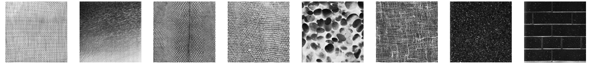
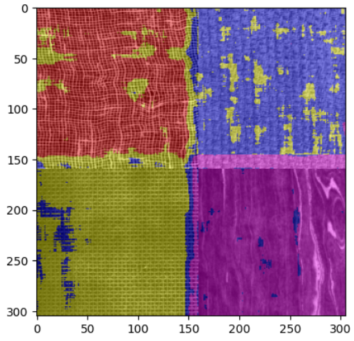
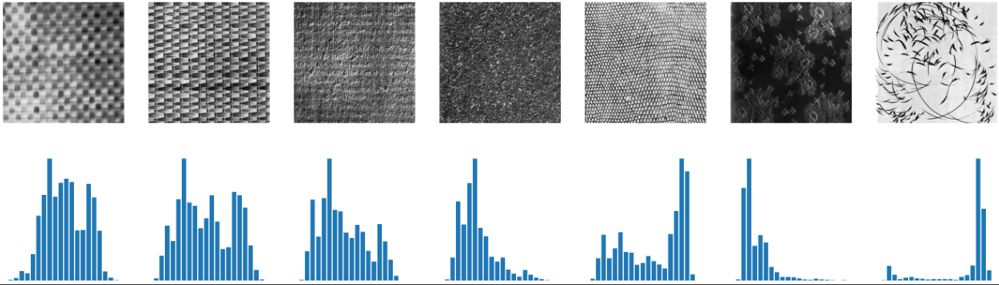
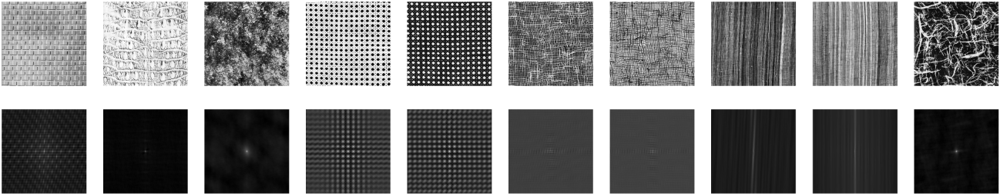

# Texture analysis 
This repository contains some jupyter notebook focusing on different ways of texture analysis/description. It's still work in progress.

## Statistical aproaches
Example of segmentaion using GLCM

Histogram analysis

Autocorrelation

### Jupyter Notebooks
- [Gray level co-occurence matrix](./Statistical_GLCM.ipynb) 
- [Histogram analysis](Statistical_histograms.ipynb)
- [Autocorrelation](Statistical_autocorrelation.ipynb)